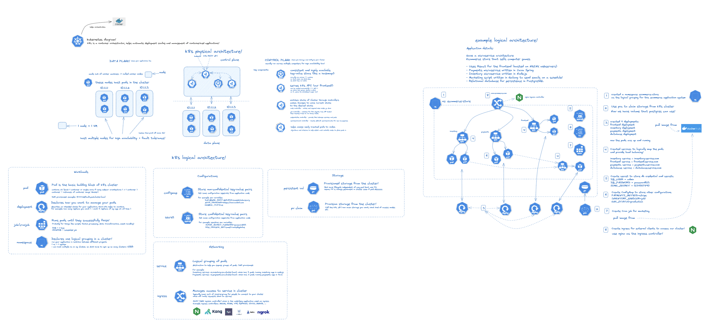

# K8s-starter-diagram

Simple diagram drawn to explain how k8s works in a nutshell. Please correct if any mistakes, am still new to k8s :blush:

## Loading the diagram in excalidraw
You can load the diagram in excalidraw. Head to [excalidraw.com](https://www.excalidraw.com) and select load diagram from disk.
 
enjoy! :blush:
